---
title: An Exploration of Array Sorting in Hardware and Software
author:
    - Anders Mæhlum Halvorsen
    - Rahmat Mozafari
    - Ole Martin Ruud
    - Øzlem Tuzkaya
institute: University of South-Eastern Norway
date: 21.09.2020
lang: en-US
bibliography: paper.bib
...

# Vision statement

Explore and implement three different sorting algorithms in software, hardware and as an integrated circuit (Intellectual Property (IP)), furthermore compare the different implementations with regards to efficiency, performance and flexibility (in particular hardware vs software tradeoffs).

# Abstract

TODO write abstract

# Introduction

TODO write introduction

# Methods

Our goal for this paper was to explore and implement three different sorting algorithms in software, hardware and as an integrated circuit (Intellectual Property (IP)), furthermore compare the different implementations with regards to efficiency, performance and flexibility (in particular hardware vs software tradeoffs).

The tools used in this paper was Vivado 2020.1, and Vitis and the Zybo Zynq-7000 board [@zybozynq7000]. We Vivado+ for the Hardware implementation of our paper, to be able to program the Zynq-7000 board. For the software and IP implementation, we took in use the Vitis IDE, where we also used the Zynq-700 board for testing the Software and IP implementation.

For all of our algorithms, we followed the same steps. We started by creating an FSMD architecture of the overall algorithm we were currently building; we did this to get an overview of what components and signals were needed. Based on the FSMD architecture created, we then designed the ASMD chart, this was done to easily convert the chart into code when implementing the algorithm, while also having a good overview of the states needed.

After finishing making all of the necessary charts, we then started to implement the sorting algorithm into Vivado. To make the code as reusable as possible we made a new file for each of our components. We also made the last two algorithms generic, such that the inputs and sizes could be adjusted by the user. 

To confirm that our sorting algorithms worked as expected we created a test bench for the project and analysed the outputs to see whether we achieved to create the algorithm or not.

The software implementation in contrast to the hardware implmentation was a much more straight forward process. We used Vitis ++ to connect our Zybo board to our computer and created a C file that would be used to implement the algorithm. For testing, we used the built-in Vitis console.

For our first algorithm, we made an effort to implement an IP implementation. Troubleshooting and implementation turned out to be an immensely time-consuming process. Seeing that the implementation of the IP would not have had a significant impact on our vision or result for our paper, we chose to exclude it.

# Results

In this section, we are going to presenting the results we gathered through to applying our methods. The suggested methods were synthesized and simulated using Vivado 2020.1 and Vitis 2020.1 and located on a Digilent Zynq-7000 Development Board with a Digilent Zybo Z7 ARM/ FPGA. The array sorting algorithms used were Selection Sort, Linear Cell Sort, and Odd-even Sort algorithm. The results were measured by simulating and outputting the data on the simulation waveform. 

## Selection sort

The Selection Sort is the most straightforward sorting algorithm. Our implementation will identify the minimum element in the array and swap it with the element in the primary position. Then it will identify the second position minimum element and swap it with the element in the second location, and it will continue executing this until the entire array is sorted. It has an $O(n^2)$ time complexity, and this is inefficient on large arrays. The input array divides into two subarrays, a sorted subarray of elements built up from top to bottom, and the remaining unsorted elements occupy the rest of the array.

See appendix \ref{} for a visual explanation of the algorithm.

### Hardware Implementation

We have created a generic counter and register in the hardware implementation, which we want to reuse as much code as possible. The comparing counter is set to 1 as a default value, and the output of the ram will be the first element in the array when we run the program. We temporarily store this index value of this element in a register and increment the index counter to compare the elements to find the smallest element in the array. Again we temporarily store the index and the value of the smallest element in registers, then we swap those elements till the array is sorted. We have removed the ram from the design file into the test bench file, which we wanted an external ram instead of an internal ram.

TODO add image of synth report

Synthesized report (Shows the power consumption) 

TODO add image of synthesized report

Summary of synthesized report

TODO make these images appear nicly on page...

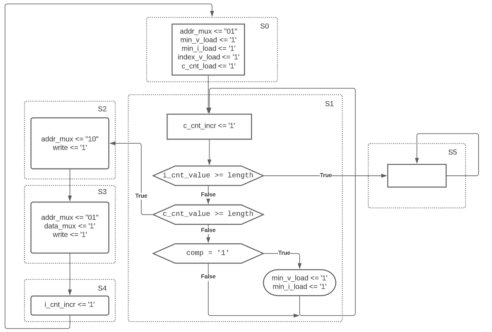{#fig:selection-asmd}

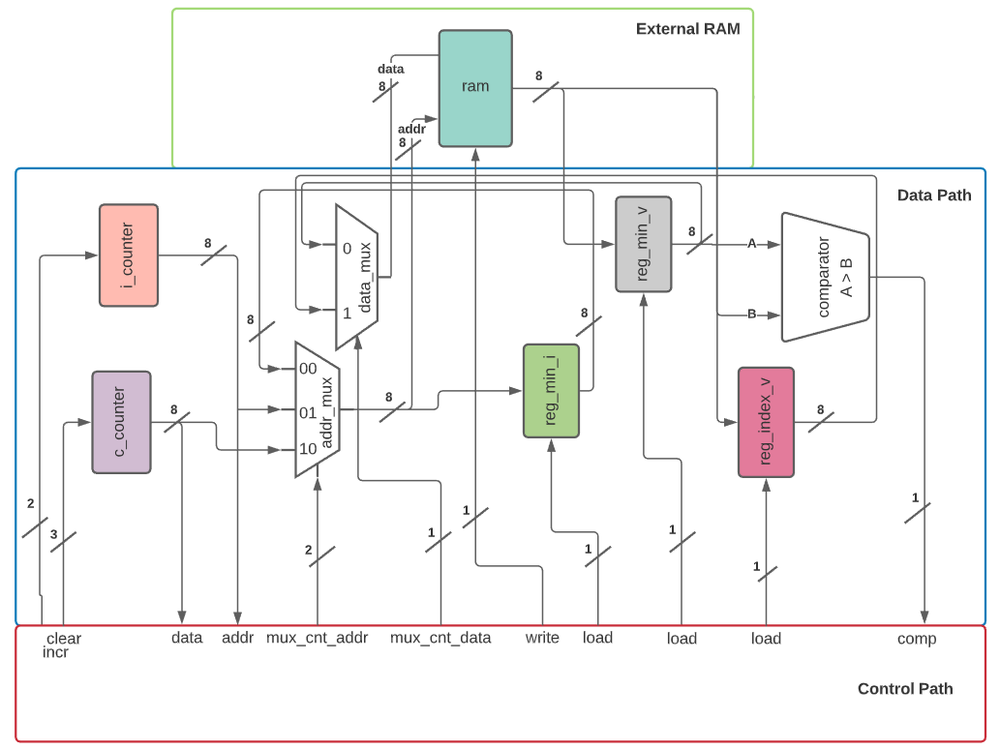{#fig:selection-fsmd}

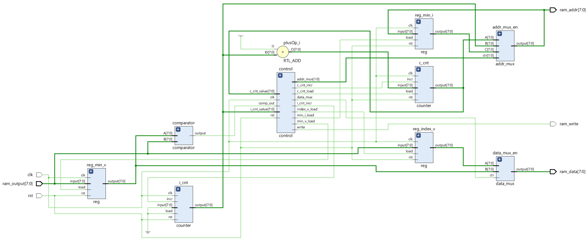{#fig:selection-schematic}

TODO add image of synthesized report

Summary of synthesized report

The picture below shows an unsorted array in the ram when the program starts. 

TODO add images of waveform diagrams

### Software Implementation

The implementation of the algorithm in software was quick to write, and certainly inspired by the hardware implementation. To keep it consistent, we decided to stick with similar names for the different components (in particular index_counter and comparing_tindex_counter). This means that it should be easy to compare the implementations. We have tested the software implementation on Zybo board and worked perfectly.

The code for the software implementation can be found in @lst:selection-code.

~~~{#lst:selection-code .c include=listings/selection-sort-sw/selection-sort.c caption="Code for software implementation of selection sort"}
~~~

### IP Implementation

In the IP-implementation, we followed the “Vivado Quick Start Tutorial” and made some necessary changes in some files. We declared some output ports and port mapped those in the “selection_sort_IP_v1_0.vhd”. Next, we made a component declaration and created some signals for inputs and outputs in the “selection_sort_IP_v1_0_S00_AXI.vhd” file. The VHDL description files created for the hardware implementation of the selection sort algorithm we copied those files into the IP directory and created a new AXI4 Peripheral for IP.
 Comment
After this, we created a new block design to integrate our IP, added, and customized the “ZYNQ7 Processing System”. Our next step was that we added “selection_sort_IP_v1.0” into our design and created HDL Wrapper. Further, we added the Sort Controller and the block memory IP blocks into our design. The block memory generator is the previously explained external RAM, while the Sort Controller enables us to inspect the memory after it has been sorted (simply enabling our software running on the ZYNQ processor to read the memory through AXI). 

TODO add image of IP block diagram

The IP block diagram including the selection sort block, sort controller and memory

Finally, after putting together the different IP blocks, we generated a bitstream to see if there was any error and also we needed to export hardware design  to the Vitis IDE. In Vitis IDE we first created a project platform for the (XSA) file extension which exported from the Vivado and generated multiple domains. We built the project and created a new application project for the software application to test our IP implementation.

To be able to display the sorted values in the serial terminal, we need to communicate with the sort controller from the Zynq prossessing unit through the AXI interface. The code that has to run on the prosessing unit can be found in listing @lst:sort-controller-code. The function Xil_In32, provided by the platform, reads a value from the AXI interface. By reading slave register 2 of the sort controller, we can tell if the sorting is done, as the first bit represents the sort_done signal. Further by then repeatedly reading slave register 1 we will get the contents of the memory block. Sort controller continuously updates the RAM address and reads the data into the slave register.

~~~{#lst:sort-controller-code .c caption="Code for communicating with the sort controller"}
include "xparameters.h"
include "xuartps_hw.h"

int main(){
	xil_printf("Start selection sort\n\n\r");

	xil_printf("Sorting");
	u32 slave_reg_2;
	do {
		slave_reg_2 = Xil_In32(XPAR_SORT_CONTROLLER_0_S00_AXI_BASEADDR + 8);
		xil_printf(".");
	} while ((slave_reg_2 & 0x1) == 0);
	xil_printf("\n\r");

	xil_printf("Printing\n\r");
	u32 slave_reg_1;
	do {
		slave_reg_2 = Xil_In32(XPAR_SORT_CONTROLLER_0_S00_AXI_BASEADDR + 8);
		slave_reg_1 = Xil_In32(XPAR_SORT_CONTROLLER_0_S00_AXI_BASEADDR + 4);
		xil_printf("%lx ", slave_reg_1);
	} while ((slave_reg_2 & 0x1) == 1);

	return 0;
}
~~~

## Linear cell sort

Linear cell sort, as detailed by Vasquez's article [@vasquez16], receives data once per clock cycle and sorts the data while it is being clocked in. This means that the algoritm only needs the $N$ clock cycles to sort the data, giving it a time complexity of $O(N)$.

Since we decided to make the algorithm generic, it will let the user decide the array's size and length. Figure 2.1 (Top FSMD architecture), the number of cells will be the same as the array size. New incoming data will be placed to the cell from top to bottom with increasing size. So when all cells are empty, the first element will automatically take the first place. Second incoming data will be compared with the first element; if it is smaller than the first element, then the first element will be moved to the second cell, and the new data will be placed to the first cell. Third incoming data will be compared with the other cells; if the incoming data is smaller than the first cell, we have a full and pushed. The first cell's data will be pushed to the second cell, and the data in the second cell will be pushed to the third cell, and the new incoming data will be placed to the first cell. The sorting algorithm will continue like this until the whole array is sorted.

-- NEW  (OVERVIEW) 

The unsorted array on the left side is ready to be sorted in serially;  on the right, our "Register cells" and the cells' size are the same as the unsorted array. We are storing the elements in the register cell and  increasing size from top to bottom.  Our main objective is to place each new element in the right position based on what is currently inside the register cell. 
 To make sure our sorting algorithm works as expected, we decided to make some basic rules. It has only four rules: 

1.  If a cell is unoccupied, it will only be populated if the cell above is full.
2.  If a cell is full, the cell data will be replaced if both the incoming data is less than the stored data, and the cell above is not pushing its data.
3.  If the cell over the current cell is pushing out its stored data, then the current cell has to replace the current data with the cell data above.
4.  If a cell is occupied and accepts new data either from the above cell or from the incoming data), it must push out the current data.

Step 1
in this step, all cells are empty, and we are beginning by inserting a new element. We place this new element at the top since all cells are empty, and this element is the smallest so far we have seen. We created a signal which it tells the cell if the cell above is occupied.  The first cell always claiming the first incoming element because we connected the cell above it to a true signal, and it is here where the rule No. 1 is applying. 

Step 2
In this case, we are inserting the second element, and we need to think about where this should go.  This element is smaller than the first, then inserting this in the first cell and the first cell kicking its element to the next empty cell, and rule No. 4 applying here. 

Step 3
Now the element, 6, roll in to be sorted, and we insert this in the 3rd position in the register cell. This element is larger than the two others we inserted so far in our cells, and we are applying rule No. 2 and 3 here. 

Step 4
In this step, we apply to rule No. 2 and insert the element, 2,  at the top cell, and each cell kicking its value to the next cell. 

Step 5
In this step, we insert the last from the unsorted array. Now we have two elements that are the same, and to insert this into the sorted cell, we apply rule No. 2 and 3. Our unsorted array are now sorted in parallel. 

### Hardware implementation

The implementation of linear cell sort algorithms was more complicated than Selection sort.  We needed to draw multi FSMD and ASMD charts to implement this in hardware. Since this algorithm uses cells and to implement this in hardware we needed to draw a FSMD and ASMD chart for this to control each cell. Then we draw another FSMD and ASMD chart to control all cells and plus other components. In our implementation we neither use RAM or ROM.

TODO make these images nicly sized..

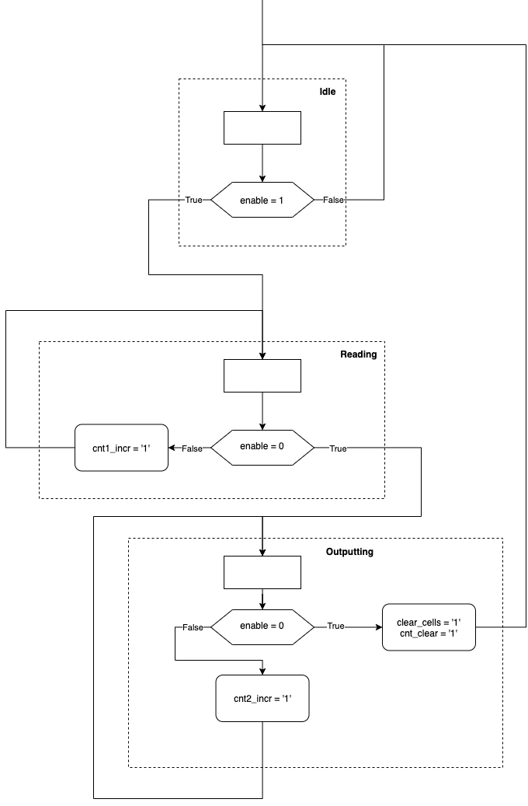{#fig:linear-cell-asmd}

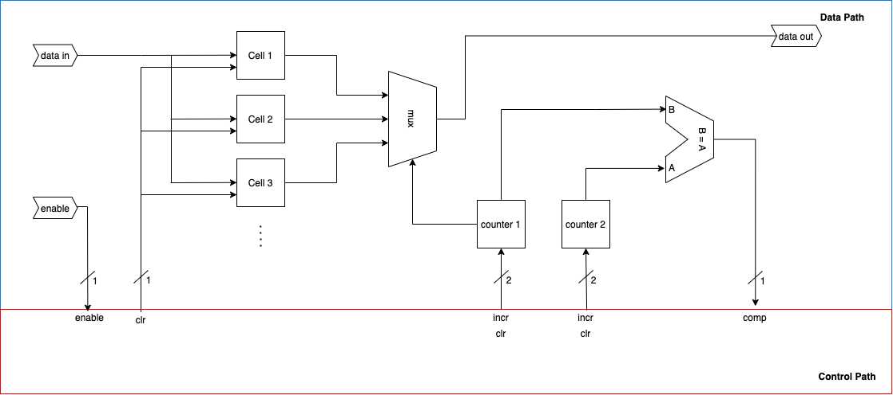{#fig:linear-cell-fsmd}

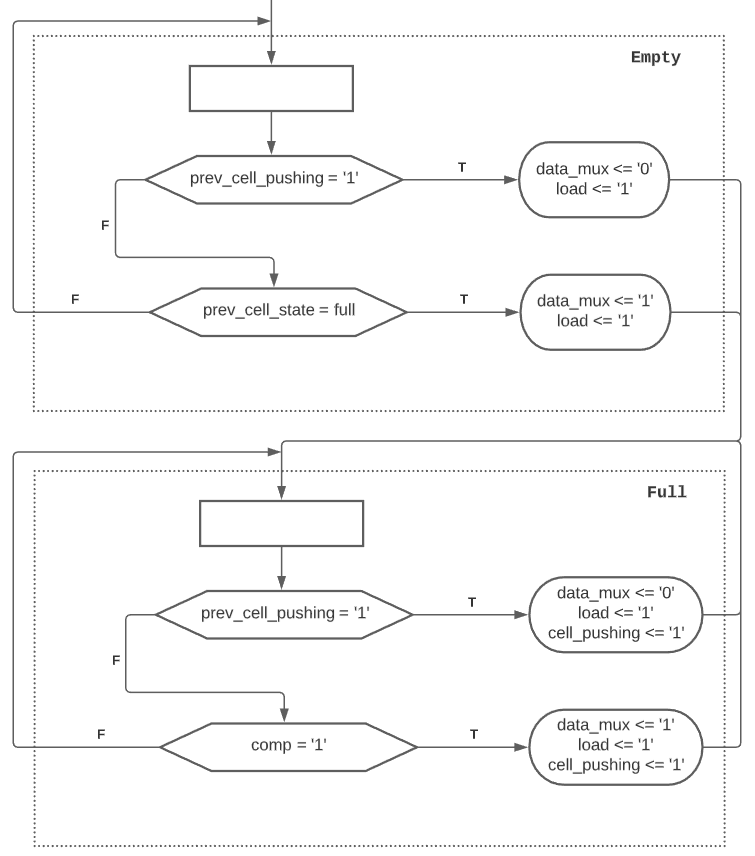{#fig:linear-cell-asmd-cell}

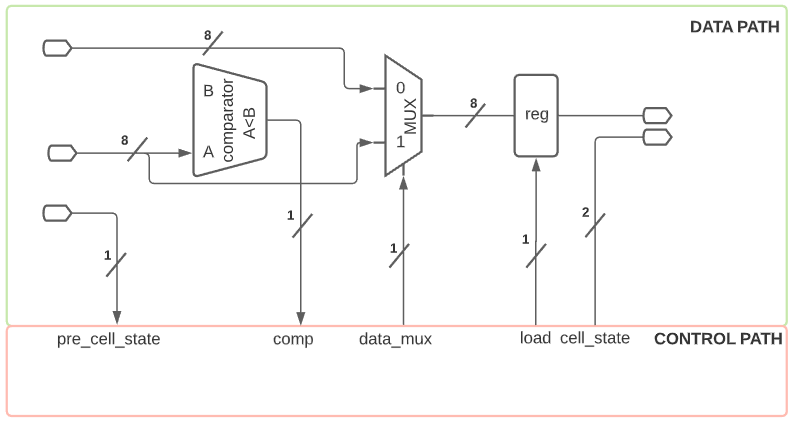{#fig:linear-cell-fsmd-cell}

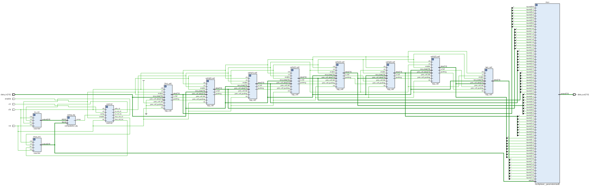{#fig:linear-cell-schematic}

TODO add image of synth report

Synthesized report of On-Chip Power

TODO add image of utilization report

Utilization synthesized report

### Software implementation

Since this algorithm is parallel by nature, there are some tradeoffs to be made when implementing it in software. As we only have a single core to work with, we have chosen to simply transform it into a sequential algorithm. This means that instead of $O(N)$ time complexity, it will be $O(N^2)$ time complexity (as we have to iterate through every cell on every insertion). As such, we chose to handle the algorithm by having a ROM and a pointer to the “incoming” input, and Instead of using cells, we chose to use an array to be simulated as multiple cells.

TODO add image of vitis serial terminal

Result from inspecting the serial monitor

The code for the software implementation of linear cell sort can be found in @lst:linear-cell-code.

~~~{#lst:linear-cell-code .c include=listings/linear-cell-sort-sw/linear-cell-sort.c caption="Code for software implementation of linear cell sort"}
~~~

## Odd-even sort
The intended algorithm is inspired from the Bubble Sort and is a relatively uncomplicated sorting algorithm. Bubble sort functioning by comparing adjacent elements; if the array elements are sorted, no swapping is terminated. Contrarily, the elements need to be switched.  The even-odd transposition sort algorithm operates by comparing all odd/even listed pairs of neighboring elements in the array if the match is in incorrect order; in other words, the primary element is bigger than the second the elements are swapped. The second step is to compare all even/odd listed matches of adjoining elements. These two steps are repeating until the array is sorted. 
Based on the book by Nvidia which details sorting using networks and parallel comparisions [@gpugems2; chapter 46].

### Hardware implementation

TODO make these images appear nicly on page

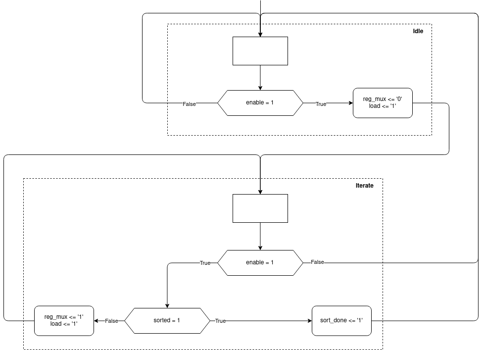{#fig:odd-even-asmd}

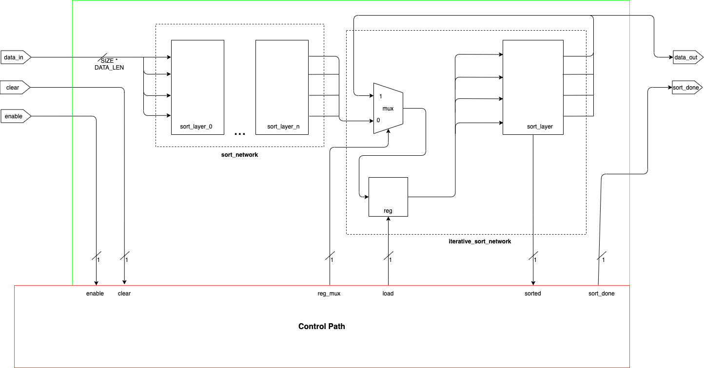{#fig:odd-even-fsmd}

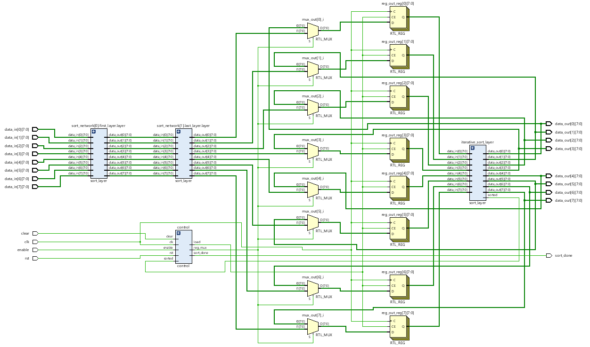{#fig:odd-even-schematic}

### Software implementation

The main challange of this algorithm is calculating the correct neighbouring indicies for comparisions. As this is already a solved problem, we simply translated the code shared by Bekbolatov [@bekbolatov15] into C to be usable for our purpose. The function simply takes the current signal index, the current layer and the internal layer index.

The code for our software implementation can be found in @lst:odd-even-code.

~~~{#lst:odd-even-code .c include=listings/odd-even-merge-sw/odd-even-merge-sort.c caption="Code for software implementation of Batcher's odd-even merge sort"}
~~~

# Discussionndting algorithlte eve

Through our exploration, we managed to get all three algoritms working in both hardware and software. Further we also found some clear distinctions between algorithms in terms of complexity, speed, size and parallelization. We will now discuss and compare the different algorithms and implementations.

## Differing development effort

The effort required by hardware and software development were quite differing. As an example we spent nearly two full days of collaboration and pair programming to implement selection sort in VHDL. On the contrary it took only about an hour to write the software implementation in C and running it on the Zybo board. We believe there are several reasons for this gap in development time.

The entire group did not have a long track record with VHDL and hardware development. Hence we spent time learning and developing our own knowledge next to the actual implementation work. As we got more experienced with hardware development the work got more focused and hence more effective. This can be clearly seen as our implementODOation of gorithm, odd-even sort, is both quite complex and modular, especially compared to our first implementthe sorting alationselection -sort. In the software domain the group is quite well versed, hence the implementations were quickly developed by individuals.

Another aspect that affected development time for hardware was the extensive development activities conducted prior to writing a single line of code. We followed a lower level approach, hence we firstly created a FSMD chart, then an ASMD chart and finally converting them into code. Further, in accordance with the development technique, we created separated files and entities for each component in the FSMD chart, hence there was quite a bit of work for each component. We did not conduct similar activities when implementing the algorithm in software, because it's at a much higher level of abstraction. It is also possible to work at a higher level of abstraction when implementing in hardware, however we did not explore this possibility because (TODO hvorfor gjorde vi ikke dette?).

One aspect that might have impacted development effort is that we consequently did the hardware implementation prior to the software implementation. As the course has been mostly focused on hardware and VHDL, we wanted to prioritize completing the hardware implementations as a group. By doing it as a group we could take advantage of discuss}

\includegraphics[page=2]{./resources/visual-explanation-selectionsortionan-sort}

\clearpage

## Linear cell sort

\includegraphics[page=1]{./resources/visual-explanation-linear-cell-sort}

\includegraphics[page=2]{./resources/visual-explanation-linear-cell-sort}

\clearpage

## Odd-even transpositions and collaboration to learn optimally. As we started out each new algorithm by working together as a group, we naturally also started with the hardware implementation. After implemenmerge sort
The intended algorithm is inspired from the Bubble Sort and is a relatively uncomplicated sorting the algorithm in hardware one can argue that we had a much better understanding of the algorithm which would mean that the following implementation in software would be easier. However since the algorithms are fairly trivial the knowledge gained from implementing it in hardware is minuscule, and therefore it is unlike. Bubble sort functioning by comparing adjacent elements; if the array elements are sorted, no swapping is terminated. Contrarily, that this had a big impact on development effort.

Lastly, despite gaining proficiency in using the tools for hardware elements need to be switched.  The development, we spent a lot of time figuring out cryptic error messages. One would think that this would improve with experience, however as we started to used more complex features we also consistently hit new errors. As an example we started using generics in our second algorithm to make it more reusable.

In conclusion, the development efforts between software and hardware were particularly highlighted in our project due to lack of knowledge, however the extensive development activities are still the major differencing factor.

## Speed

TODO

# Conclusion

TODO

# References {-}

::: {#refs}
:::

\clearpage
\appendix

# Visual explanations of the sorting algorithms

## Selection sort

\includegraphics[page=1]{./resources/visual-explanation-selection-sort}

\includegraphics[page=2]{./resources/visual-explanation-selection-sort}

\includegraphics[page=3]{./resources/visual-explanation-selection-sort}

\clearpage

## Linear cell sort

\includegraphics[page=1]{./resources/visual-explanation-linear-cell-sort}

\includegraphics[page=2]{./resources/visual-explanation-linear-cell-sort}

\clearpage

## Odd-even transposition and merge sort
n-odd transposition sort algorithm operates by comparing all odd/even listed pairs of neighboring elements in the array if the match is in incorrect order; in other words, the primary element is bigger than the second the elements are swapped. The second step is to compare all even/odd listed matches of adjoining elements. These two steps are repeating until the array is sorted. 

\includegraphics[page=1]{./resources/visual-explanation-even-odd-transition-and-merge-network.pdf}

<!--stackedit_data:
eyJkaXNjdXNzaW9ucyI6eyJSYlRmRzUwOUpTRllTSmRHIjp7In
RleHQiOiJXZSB1c2VkIFZpdmFkbyBmb3IgdGhlIEhhcmR3YXJl
IGltcGxlbWVudGF0aW9uIG9mIG91ciBwYXBlciwgdG8gYmUgYW
JsZSB0byBwcm9n4oCmIiwic3RhcnQiOjExMDAsImVuZCI6MTM1
NX19LCJjb21tZW50cyI6eyJFVzdWZUpkNHJxNFZNVXR0Ijp7Im
Rpc2N1c3Npb25JZCI6IlJiVGZHNTA5SlNGWVNKZEciLCJzdWIi
OiJnaDozMTIzOTQ3MSIsInRleHQiOiJUZW5rdGUgw6UgZW5kcm
UgbGl0dCBww6UgZGVubmUiLCJjcmVhdGVkIjoxNjAwNTE3ODMz
ODgxfX0sImhpc3RvcnkiOls3MzE0NDg0NDEsLTE4MzAzMDUyNC
wtMjUyMjkyNzM3LC0xOTMyNzI0NzU4LC0xNTYwMTc1NDg3LDEw
NjU0NDU5MTQsLTE3NzA0Mzc2NDMsNzEzNzc4NTM0LDY3NDg0OD
AsMTg5NzA0NTgxLC0yMDU5NzA4ODYyLC0xMDAzOTYzODE2LC0x
NjYwNTgyNzQ4LC0xMTM1NTA3Mjg0LDIwODIwMTA2NTEsLTg3MD
Y4MDU0OSwtMTUxMTMyNzI4Nyw0NjEwNTA1NzUsLTUwMjM1NDA3
MCwtNjM1MTYwNDMyXX0=
-->